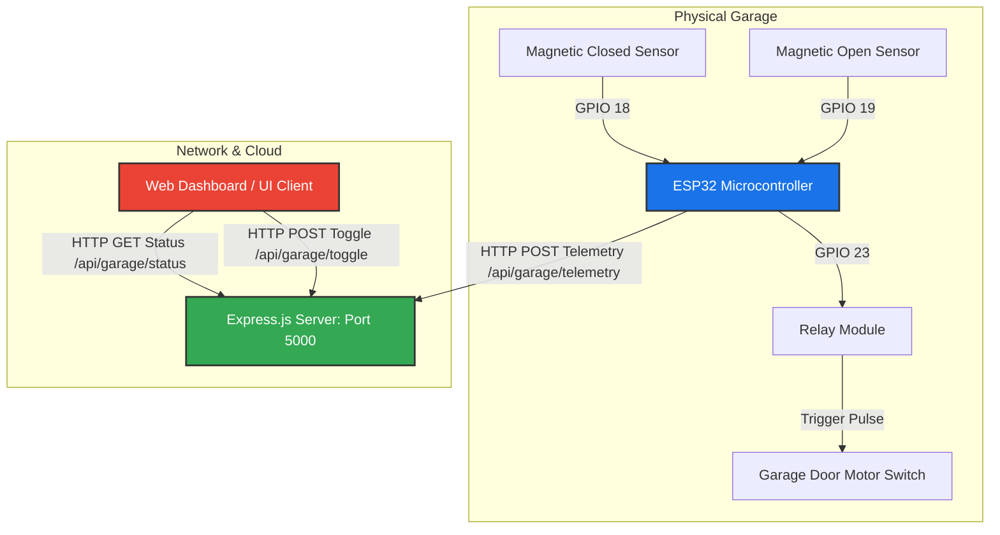

# 🚪 Automatic Garage Door IoT System

A premium, full-stack IoT garage door monitoring and control system. This repository contains both the **C++ (Arduino/ESP32) firmware** for the physical microcontroller and a **Node.js/Express server** that handles telemetry ingestion and triggers mechanical operations.

---

## 📐 System Architecture



---

## 🔌 Hardware Connections & Pinout

If you are using an **ESP32 NodeMCU Development Board**, here is the standard wiring diagram for the magnetic sensor switches and the relay.

| Component | Pin (ESP32) | Pin Type | Notes |
| :--- | :--- | :--- | :--- |
| **Relay Signal Pin** | `GPIO 23` | Digital Output | Active High pulse activates door motor |
| **Closed Sensor** | `GPIO 18` | Digital Input (`INPUT_PULLUP`) | Magnetic switch at the bottom of the track |
| **Open Sensor** | `GPIO 19` | Digital Input (`INPUT_PULLUP`) | Magnetic switch at the top of the track |
| **VCC / GND** | `3.3V / GND` | Power | Supply power to sensors and relay modules |

---

## 📂 Project Structure

```plaintext
Automatic_Garage_Door/
├── firmware/
│   ├── firmware.ino          # ESP32 Main Sketch
│   ├── config.example.h      # Template configuration file for Wi-Fi & Servers
│   └── config.h              # Private configuration (Excluded from Git)
├── server/
│   ├── server.js             # Node.js / Express Server API
│   └── package.json          # Node Dependencies & Scripts
├── .gitignore                # Avoids committing sensitive credentials
└── README.md                 # Project documentation (this file)
```

---

## 🚀 Setup & Execution Guide

### 1. Hardware Firmware Setup
1. Open the [firmware/firmware.ino](file:///e:/HIMANSHU%20College/Sem-5/Practical/IOT/Automatic_Garage_Door/firmware/firmware.ino) folder in your Arduino IDE or PlatformIO.
2. In the `firmware/` directory, copy `config.example.h` and rename it to `config.h` (or use the pre-generated file):
   ```bash
   cp firmware/config.example.h firmware/config.h
   ```
3. Open `config.h` and fill in your home/campus Wi-Fi credentials and target Express server IP:
   ```cpp
   const char* WIFI_SSID = "YOUR_WIFI_SSID";
   const char* WIFI_PASSWORD = "YOUR_WIFI_PASSWORD";
   const char* SERVER_HOST = "YOUR_SERVER_IP"; 
   const int SERVER_PORT = 5000;
   ```
4. Install the **ESP32 Board Library** in Arduino IDE and upload `firmware.ino` to your board.

### 2. Backend Server Deployment
1. Navigate to the server folder:
   ```bash
   cd server
   ```
2. Install the necessary dependencies (Express and CORS):
   ```bash
   npm install
   ```
3. Start your local server:
   ```bash
   npm start
   ```
   *The console will display: `Garage Door IoT Server running locally on port 5000`*

---

## 🌐 API Endpoint Specifications

All endpoints are hosted on `http://<SERVER_HOST>:<PORT>` (default port is `5000`).

### 1. Update Telemetry
* **Method:** `POST`
* **Path:** `/api/garage/telemetry`
* **Description:** Used by ESP32 to publish door status.
* **Payload:**
  ```json
  {
    "status": "closed" // "open", "closed", or "moving"
  }
  ```

### 2. Retrieve Status
* **Method:** `GET`
* **Path:** `/api/garage/status`
* **Description:** Retrieves the current tracking state and the exact time of the last update.
* **Response:**
  ```json
  {
    "status": "closed",
    "lastUpdated": "2026-05-19T15:22:45.000Z"
  }
  ```

### 3. Toggle Door Motor
* **Method:** `POST`
* **Path:** `/api/garage/toggle`
* **Description:** Triggers a relay pulse to activate the garage motor.
* **Response:**
  ```json
  {
    "success": true,
    "message": "Trigger pulse command broadcasted successfully."
  }
  ```

---

## 🛠️ Git Tracking & Remote Push
To track your local changes and push them to your personal GitHub repository, execute the following commands in the root of your project folder:

```bash
# Initialize tracking
git init

# Add files
git add .

# Save local commit
git commit -m "Initial commit: Restored garage door hardware firmware and backend endpoints"

# Rename branch
git branch -M main

# Link remote (Replace with your repository)
git remote add origin https://github.com/YOUR_GITHUB_USERNAME/YOUR_REPOSITORY_NAME.git

# Push live
git push -u origin main
```
